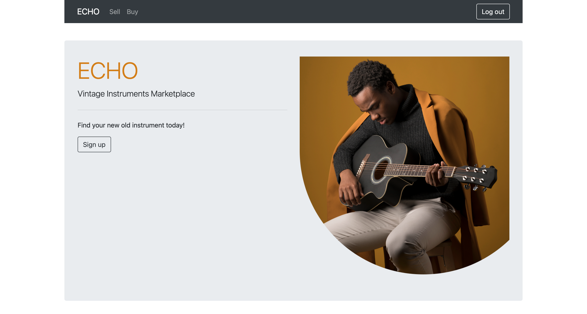

# T2A2 - Marketplace Project

 Yannick Beaucaine

---
 

## ECHO Marketplace 
---
 

## R7 - Identification of the problem you are trying to solve by building this particular marketplace app.
---
ECHO was designed and built by and for music industry professionals.
The platform was created to provide a new standard for a niche set of 
like -minded people.

We believe that creating a platform that is supported and used by community specialists will provide the best experience possible for anyone looking to sell and acquire specialized gear for a special purpose of their consideration.

Other available websites like Ebay and others offer an enormous variety of non related products, making it hard to understand and follow an appropriate and reasonable price guide, therefore creating a sense of insecurity when buying such specialized products. More often than not, finding the right item in large websites such as those, returns inaccurate and fluctuating prices based on inexperience.

By creating a website that specializes in one type of product, we hope to solve this problem by connecting a community of knowledgeable people through a one-stop shop.

For this specific market, making searches more accurate for both parties.
Sellers can list their product and base their prices by looking at the marketplace. Buyers can find their instruments at the best price and both can proceed with the transaction via a secure online payment platform dedicated to the Australian market.
 

## R8 - Why is it a problem that needs solving?
---
Although there are many other platforms that offer a similar type of service (eg: Ebay, gumtree and others) none is particularly specialized in this specific market for Australia.
Finding similar products in such big institutions also means that it makes it more difficult 
to filter through the authenticity and real value of the products that they offer.
Sellers can easily change their location and offer products from overseas.
This makes it hard to dispute any issues if the product for sale isn’t as advertised.
A dedicated website for the Australian market also means that it could be covered under
Australian consumer laws, which adds another layer of protection.
Additionally the smaller scale of the application will yield better results when
searching for the exact product the user is looking for.
 

## R9 - A link (URL) to your deployed app (i.e. website)
---

## https://mighty-shelf-87669.herokuapp.com/

 

## R10 - A link to your GitHub repository (repo).
---

## https://github.com/YannickBeaucaine/T2A2_Echo_Marketplace

 

## R11 - Description of your marketplace app (website), including:
---

## - Purpose

ECHO is an online marketplace dedicated to the resell of vintage music instruments and equipment.The purpose of the application is to allow public users to list new or used gear, by providing a comprehensive listing platform to help buyers and sellers post their goods for sale and browse listings. ECHO acts as a ‘middle-man’ and moderates posted listings to provide a better user experience. It also provides users guidance for the resell and buying of their listing - making it a one stop shop for everything about Vintage music equipment.
## - Functionality / features
From the home page, after logging in, the user will be able to access the “Sell” page and the “Buy” page. It is made of a simple interface with minimal graphics and easy to understand functionalities. This page is accessible for anyone to Browse.
The “Buy” page is presented as a grid to make browsing a simple user experience. 
Users can scroll through the page to browse through the listing or use the search bar
to narrow down their search to more specific words for their convenience.

The “Sell” page is presented in a form factor allowing the user to easily fill in the required information needed to complete the sale. Questions such as: Condition, Name, Price and Description are to be filled and an image of the item for sale can be uploaded.This page is only accessible for Logged in users. Listings will automatically appear on its appropriate page once submitted.
Listed items can additionally be edited after submission.

## - Sitemap

 

## - Screenshots

 

main page
 

singup page
 

login page
 

listing/buy page
 

show page
 

sell page
 

pay page
 
## - Target audience
The target audience for ECHO is a large demographic of music instrument collectors and musicians of all kinds looking to buy or sell rare and sought after vintage instruments that cannot be found in a standard music shop. Film score music composers, sound designers and music producers are always looking for new and old sounds to explore, and vintage music equipment has a long reputation of being used for these purposes. ECHO is here to provide them with a simple buy and sell platform to feed their creativity, and allow the community to communicate which strengthens the reliability of the platform.
## - Tech stack (e.g. html, css, deployment platform, etc)

ECHO Tech stack

 

## R12 - User stories for your app
---

## - Seller:

As a seller, I would like an application to list my gear to like-minded people

As a seller, I want a secure platform with a reliable payment system

As a seller, I want to be able to compare prices between listings

As a seller, I want to be able to edit and adjust my listing at my convenience

As a seller, I want to be able to delete my listing at my convenience

As a seller, I want to be able to post an image of my listing

As a seller, I want a simple and functional platform to sell my gear

## - Buyer:

As a buyer, I want to be able to see and compare listings on one page

As a buyer, I want to be able to buy from a secure platform

As a buyer, I would like to be able to search through the listings with a search bar

As a buyer, I want to be able to see images of the listings available

As a buyer, I want a simple and functional platform to buy
 

## R13 - Wireframes for your app
---

## - Mobile version

home page / listing page

## - Ipad version

home page / listing page

## - Desktop version

home page / listing page

 

## R14 - An ERD for your app
---

 

## R15 - Explain the different high-level components (abstractions) in your app
---

ECHO is a two sided marketplace, built on Ruby on Rails. Rails uses a built-in
Framework called MVC ( model, view, controller). This software design pattern is designed to be a simpler way to quickly build  web-application by separating each function. The model contains data, states and logic for the application. The view generates the user interface that is displayed to the user, and the controller relays the interactions between the view and the model to the user.

The database is handled by PostgreSQL,an open source Relational Database Management System. It allows the application to store and process data in table form.

The Authentication for ECHO is managed by the Devise gem. This gem simplifies the development of the application by handling the authentication capabilities of the application. It also automatically generates login and signup forms which greatly maximises the security of the application.

Authorisation is a very important security feature of any application, in this case the CanCanCan gem offers a library that allows to restrict certain features depending on the given access of the user. For example, using this gem, malicious users won’t be able to access certain pages of the application through URL if they do not own the pages admin access.

For the visual part, ECHO is making use of Bootstrap gem, a simplified and easy way to use CSS. It does so by providing templates and simplified in line styling by writing classes. Bootstrap is also dynamic and helps with the compatibility across all platforms.

Javascript is used for some display functionalities and button actions linking to the
Stripe online payment system. Although very little Javascript is used in this application, it is helping create a seamless connection between the user and Stripe.

Node.js is a cross platform back-end Javascript 
Runtime environment that allows writing on the server side of the application.

Yarn is another complementary Javascript framework package manager, and helps accelerate the management of packages, ultimately improving the performance of the application.
 

## R16 - Detail any third party services that your app will use
---

## - Amazon S3 :

Amazon S3 ( Simple Storage Service) is a free online storage service provided by Amazon. It is an object storage service operated through web service that allows
users with appropriate credentials to freely use their service to store files such as images and others. Once signed up the developers are provided with a secret key and an API that will need to be added to the “credentials.yml” file within the application. The files need to be decrypted and encrypted back to function. Once done and the appropriate files are installed. Files in the application can be stored and accessed from the services. Additionally, it provides services such as backup and recovery, disaster recovery, data archives, data lakes for analytics, and hybrid cloud storage.

## - Stripe :

Stripe is a free to use online payment  processing system that can be used as an API with the Rails application. It is compliant with the Australian laws and makes it easy to quickly add a secure payment system to the application. It has no setup fees and no monthly fees for their services but does charge small amounts for the transactions that are charged to the application users. Stripe supports every major payment system that can be integrated to the application and operates internationally.

## - Heroku :

Heroku is a free cloud platform service. It works by running applications on dynos ( virtual machines ) hosted by Amazon Web Services. Echo is deployed on heroku through github and runs applications seamlessly through the browser.

## - Github :

Github is a free online host for software development and version control using Git. Github offers the distributed version control and source code management functionality of Git.
Echo is currently hosted on Github and allows for team collaboration online and can be used as a backup system for the applications repo.

 

## R17 - Describe your projects models in terms of the relationships (active record associations) they have with each other
---

## - users :

### -A user has many listings :
In this case, a user has the ability to post as many listings as they want.
This is a One-to-many relationship. 
### - A user has many purchases :
As user should have the ability to make as many purchases as desired.
This is a One-to-many relationship. 

 

## - purchases :
### - A purchase belongs to listings :
A purchase should belong to the listings page, a listing is connected to the purchases table with its listing ID.
### - A purchase belongs to a user :
A purchase should belong to only one user, the tables between the buyer ID and
the purchase are connected.

 

## - listings :
### - A listing has one purchase
A listing should only be puchased once, then deleted from the listings .
### - A listing has many images
A listing can contain one or more images.
### - A listing belong to a user
A listing belongs to only one user.

 

## R18 - Discuss the database relations to be implemented in your application
---

 

A user has the ability once logged in as seller to post as many listings as they like,
the user ID is connected to the listing with a primary key.
The user has an email, password and a boolean value is added to define if the 
user is an admin or not, thus giving the ability to restrict acces to some parts of the application. The listings table contains informations about the listing
such as the name, the price of an item, description, a seller ID, as well as a status that defines the availabilty of the listing.
Although a user can have many purchases, a purchase itself should only belong to one user. The buyer ID and the listing are connected.
Additionaly, a listing can contain one or more images.
Finally in order to connect the purchase to stripe and to receive aditional information
from the API a receipt URL and a payment intent as added to the table.

## R19 - Provide your database schema design
---

Schema Design
 

## R20 - Describe the way tasks are allocated and tracked in your project
---

Working on Echo has been a great challenge, I have started this project by creating a detailed Trello board and have updated the list while progress was being made.
I started initially by separating the types of tasks such as Coding, Designing and research and have proceeded to create a board with tags reflecting those types of tasks with color coding and an estimated time for completion. Futhermore, some additional future features I wanted to implement in my app have been added to my board as well. This board has been updated on a daily basis trying to follow as much logic as possible as you can see from the progression on these screenshots.The progress of the work is tracked by moving the task cards accordingly in their respective list.

Link To Trello:
## https://trello.com/b/Cb1Y4qkD/echo-marketplace
 

 
 
 
 

Trello Board

 

